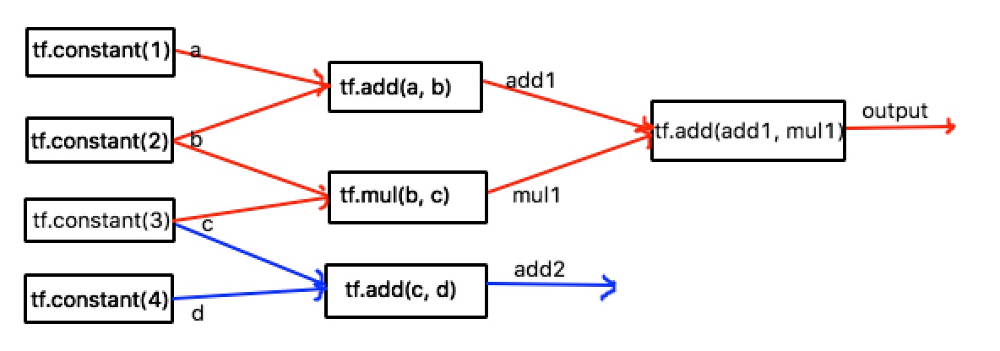

# 简介 #
Tensorflow是基于图（Graph）的计算系统。而图的节点则是由操作（Operation）来构成的，而图的各个节点之间则是由张量（Tensor）作为边来连接在一起的。所以Tensorflow的计算过程就是一个Tensor流图。Tensorflow的图则是必须在一个Session中来计算。这篇笔记来大致介绍一下Session、Graph、Operation和Tensor。

# [Session](http://www.tensorfly.cn/tfdoc/api_docs/python/client.html) #

Session提供了Operation执行和Tensor求值的环境。如下面所示，

```python
import tensorflow as tf

# Build a graph.
a = tf.constant([1.0, 2.0])
b = tf.constant([3.0, 4.0])
c = a * b

# Launch the graph in a session.
sess = tf.Session()

# Evaluate the tensor 'c'.
print sess.run(c)
sess.close()

# result: [3., 8.]
```

一个Session可能会拥有一些资源，例如Variable或者Queue。当我们不再需要该session的时候，需要将这些资源进行释放。有两种方式，

1. 调用session.close()方法；
2. 使用with tf.Session()创建上下文（Context）来执行，当上下文退出时自动释放。

上面的例子可以写成,
```python
import tensorflow as tf

# Build a graph.
a = tf.constant([1.0, 2.0])
b = tf.constant([3.0, 4.0])
c = a * b

with tf.Session() as sess:
  print sess.run(c)
```

Session类的构造函数如下所示：

> tf.Session.\_\_init\_\_(target='', graph=None, config=None)

如果在创建Session时没有指定Graph，则该Session会加载默认Graph。如果在一个进程中创建了多个Graph，则需要创建不同的Session来加载每个Graph，而每个Graph则可以加载在多个Session中进行计算。

执行Operation或者求值Tensor有两种方式：

1. **调用Session.run()方法：**
  该方法的定义如下所示，参数fetches便是一个或者多个Operation或者Tensor。
  > tf.Session.run(fetches, feed_dict=None)

2. **调用Operation.run()或则Tensor.eval()方法：**
  这两个方法都接收参数session，用于指定在哪个session中计算。但该参数是可选的，默认为None，此时表示在进程默认session中计算。
  
那如何设置一个Session为默认的Session呢？有两种方式：

1. 在with语句中定义的Session，在该上下文中便成为默认session；
   上面的例子可以修改成：
   ```python
   import tensorflow as tf

   # Build a graph.
   a = tf.constant([1.0, 2.0])
   b = tf.constant([3.0, 4.0])
   c = a * b

   with tf.Session():
     print c.eval()
   ```

2. 在with语句中调用Session.as_default()方法。
   上面的例子可以修改成：
   ```python
   import tensorflow as tf

   # Build a graph.
   a = tf.constant([1.0, 2.0])
   b = tf.constant([3.0, 4.0])
   c = a * b
   sess = tf.Session()
   with sess.as_default():
     print c.eval()
   sess.close()
   ```

# [Graph](http://www.tensorfly.cn/tfdoc/api_docs/python/framework.html#Graph) #
Tensorflow中使用tf.Graph类表示可计算的图。图是由操作Operation和张量Tensor来构成，其中Operation表示图的节点（即计算单元），而Tensor则表示图的边（即Operation之间流动的数据单元）。

> tf.Graph.\_\_init\_\_()
创建一个新的空Graph

在Tensorflow中，始终存在一个默认的Graph。如果要将Operation添加到默认Graph中，只需要调用定义Operation的函数（例如tf.add()）。如果我们需要定义多个Graph，则需要在with语句中调用Graph.as\_default()方法将某个graph设置成默认Graph，于是with语句块中调用的Operation或Tensor将会添加到该Graph中。

例如，
```python
import tensorflow as tf
g1 = tf.Graph()
with g1.as_default():
    c1 = tf.constant([1.0])
with tf.Graph().as_default() as g2:
    c2 = tf.constant([2.0])

with tf.Session(graph=g1) as sess1:
    print sess1.run(c1)
with tf.Session(graph=g2) as sess2:
    print sess2.run(c2)

# result:
# [ 1.0 ]
# [ 2.0 ]
```

如果将上面例子的sess1.run(c1)和sess2.run(c2)中的c1和c2交换一下位置，运行会报错。因为sess1加载的g1中没有c2这个Tensor，同样地，sess2加载的g2中也没有c1这个Tensor。


# [Operation](http://www.tensorfly.cn/tfdoc/api_docs/python/framework.html#Operation) #
一个Operation就是Tensorflow Graph中的一个计算节点。其接收零个或者多个Tensor对象作为输入，然后产生零个或者多个Tensor对象作为输出。Operation对象的创建是通过直接调用Python operation方法（例如tf.matmul()）或者Graph.create\_op()。

例如```c = tf.matmul(a, b)```表示创建了一个类型为MatMul的Operation，该Operation接收Tensor a和Tensor b作为输入，而产生Tensor c作为输出。

当一个Graph加载到一个Session中，则可以调用Session.run(op)来执行op，或者调用op.run()来执行（op.run()是tf.get\_default\_session().run()的缩写）。

# [Tensor](http://www.tensorfly.cn/tfdoc/api_docs/python/framework.html#Tensor) #
Tensor表示的是Operation的输出结果。不过，Tensor只是一个符号句柄，其并没有保存Operation输出结果的值。通过调用Session.run(tensor)或者tensor.eval()方可获取该Tensor的值。


# 关于Tensorflow的图计算过程 #
我们通过下面的代码来看一下Tensorflow的图计算过程：
```python
import tensorflow as tf
a = tf.constant(1)
b = tf.constant(2)
c = tf.constant(3)
d = tf.constant(4)
add1 = tf.add(a, b)
mul1 = tf.mul(b, c)
add2 = tf.add(c, d)
output = tf.add(add1, mul1)
with tf.Session() as sess:
    print sess.run(output)
# result: 9
```

上面的代码构成的Graph如下图所示，


当Session加载Graph的时候，Graph里面的计算节点都不会被触发执行。当运行sess.run(output)的时候，会沿着指定的Tensor output来进图路径往回触发相对应的节点进行计算（图中红色线表示的那部分）。当我们需要output的值时，触发Operation tf.add(add1, mul1)被执行，而该节点则需要Tensor add1和Tensor mul1的值，则往回触发Operation tf.add(a, b)和Operation tf.mul(b, c)。以此类推。

所以在计算Graph时，并不一定是Graph中的所有节点都被计算了，而是指定的计算节点或者该节点的输出结果被需要时。
